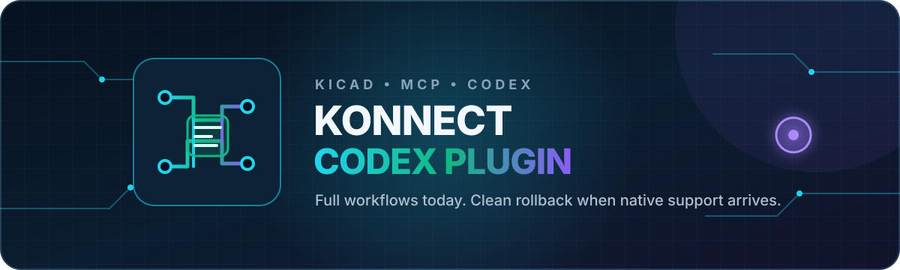

<p align="center">
  
</p>

<h1 align="center">Konnect Codex Plugin</h1>

<p align="center"><strong>A reviewed, versioned, first-class Codex plugin for Konnect.</strong></p>

<p align="center">
  <a href="https://github.com/neusse/konnect-codex/actions/workflows/ci.yml"></a>
  <a href="https://github.com/neusse/konnect-codex/blob/main/LICENSE"></a>
  
  
  <a href="https://github.com/mixelpixx/Konnect"></a>
  <a href="https://github.com/neusse/konnect-codex/releases/latest"></a>
</p>

`konnect-codex` is a standalone **Codex plugin** for the Konnect server. It
packages reviewed Codex-native skills, agents, hooks, and MCP configuration so
Konnect behaves like a first-class Codex integration. It is deliberately
separate from Konnect so each release can preserve a known-good Codex workflow
without changing Konnect itself.

Release numbers match the Konnect release reviewed by the plugin:
`konnect-codex v0.5.1` supports `Konnect v0.5.1`. The exact reviewed upstream
commit and guidance fingerprints are recorded in
[`compatibility.json`](compatibility.json).

The plugin supplies:

- six independently reviewed Codex skills plus the execution router;
- a Codex execution-router skill that makes the eager-tool profile and safe
  KiCad workflow explicit;
- two reviewed Codex agents without a hard-coded model;
- Codex-native hooks, relevant-prompt guidance, and a live-KiCad IPC fallback;
- a private Konnect configuration with `eager_toolsets = true` so clients that
  cache the first MCP tool list can see the complete tool catalogue;
- ownership, health checks, disable/enable, and exact uninstall support.

The reviewed plugin skills are authoritative by default. Do not run
`konnect init --client codex`; that installs another set of skills with the same
names. If they are already installed, remove only that native guidance with
`konnect uninstall --client codex` before syncing the plugin. An explicit
`--prefer-native-skills` option remains available for future compatibility
testing.

## Upstream and credit

<p align="center">
  <a href="https://github.com/mixelpixx/Konnect">
    
  </a>
  <br>
  <sub>Original Konnect artwork; displayed here with credit to the upstream project.</sub>
</p>

[Konnect](https://github.com/mixelpixx/Konnect) is created and maintained by
[mixelpixx](https://github.com/mixelpixx). Konnect provides the KiCad MCP server,
tool catalogue, file-safety model, and original hardware workflows on which
this plugin depends. `konnect-codex` is an independent Codex plugin and
does not replace or claim authorship of Konnect. Please report server and KiCad
tool issues to the upstream project and support its development there.

## Install with Codex

Open a Codex task and paste the following request. Codex can select the correct
release for the current operating system, verify it, install the plugin, and
run its health check for you:

```text
Install the konnect-codex v0.5.1 plugin from
https://github.com/neusse/konnect-codex/releases/tag/v0.5.1 for this operating
system. Download SHA256SUMS.txt and verify the archive before extracting it.
Install the konnect-codex executable in a user-writable location on PATH and
confirm that Konnect v0.5.1 is installed. Do not run `konnect init --client
codex`. If Konnect's native Codex guidance is already installed, remove only
that guidance with `konnect uninstall --client codex`. Preserve the Konnect
server and its configuration. Run `konnect-codex sync`, then
`konnect-codex doctor`. Report the installed paths and health result, and tell
me when to start a new Codex task.
```

The installer registers `konnect-codex@personal` through Codex's plugin system.
Start a new Codex task after installation so Codex discovers the plugin's
skills, agents, hooks, and MCP server.

## Manual installation

Install the matching Konnect release normally, without its Codex guidance flag.
Then download the archive for your operating system from
[GitHub Releases](https://github.com/neusse/konnect-codex/releases/latest), put
`konnect-codex` on `PATH`, and run:

```powershell
konnect-codex sync
konnect-codex doctor
```

You can also install the version-matched source release with Cargo:

```powershell
cargo install --git https://github.com/neusse/konnect-codex --tag v0.5.1
konnect-codex sync
konnect-codex doctor
```

Or install from a local checkout:

```powershell
cargo install --path .
konnect-codex sync --konnect C:\path\to\konnect.exe --config C:\path\to\konnect.toml
konnect-codex doctor
```

`sync` installs the reviewed assets embedded in this release; it does not
translate files from `~/.claude`. Passing `--source <path>` asks it to verify
that a Konnect checkout or installed asset directory still matches the reviewed
fingerprint before installation.

Codex requires the user to review and trust newly installed plugin hooks before
it runs them.

## Lifecycle

```powershell
konnect-codex disable       # remove active plugin and agents, retain generated state
konnect-codex enable        # reactivate the retained integration
konnect-codex audit         # verify installed Claude-side assets still match this release
konnect-codex native-status # compare native Konnect coverage with the plugin
konnect-codex uninstall     # remove only plugin-owned files and marketplace entry
```

`uninstall` verifies hashes before removing anything. If a managed file was
edited after installation, it stops and preserves the file. `--force` is
available only for intentionally discarding those plugin-owned edits.

## Generated locations

- Plugin source: `~/plugins/konnect-codex`
- Codex agents: `~/.codex/agents/konnect_*.toml`
- State/config: `~/.konnect/codex-companion`
- Marketplace entry: `~/.agents/plugins/marketplace.json`

The plugin is installed as `konnect-codex@personal` using the Codex CLI. Native
Konnect skills under `~/.agents/skills` are neither replaced nor removed; use
Konnect's client-scoped uninstall command if you previously installed them.

## Release review process

Every Konnect release is handled as a compatibility review:

1. Compare upstream skills, references, agents, hooks, tool names, and required
   arguments with the previous reviewed release.
2. Adapt client-specific wording and execution assumptions for Codex.
3. Run `konnect-codex audit --source <Konnect checkout>` against the pinned
   version, commit, guidance fingerprint, and hook fingerprint.
4. Validate skill frontmatter, agent TOML, lifecycle safety, tests, clippy, and
   packaging on Windows, Linux, and macOS.
5. Publish the matching tag and downloadable archives.
